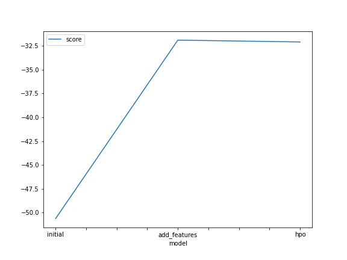
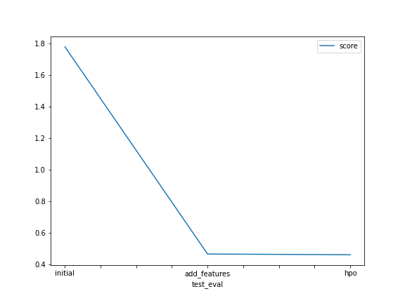

# Report: Predict Bike Sharing Demand with AutoGluon Solution

#### Hossam Khairullah

## Initial Training

### What did you realize when you tried to submit your predictions? What changes were needed to the output of the predictor to submit your results?

<!-- TODO: Add your explanation -->

What stood out is that some of the output was negative, and for a `count`
property that just does not make sense.

Of course remedying that was simply cutting off at the lowest threshold, so all
negative values were replaced by zeros.

### What was the top ranked model that performed?

<!-- TODO: Add your explanation -->

The top ranked model was `WeightedEnsemble_L3`. But aside from that model, which
is an autogluon ensemble, the next top ranked model was `NeuralNetFastAI_BAG_L2`.

## Exploratory data analysis and feature creation

### What did the exploratory analysis find and how did you add additional features?

<!-- TODO: Add your explanation -->

The histogram of the data showed balanced `season` feature, that is: there is an
equal number of observations for each of the categories involved.

The `holiday` feature was really imbalanced, with only $2.85688$% is true, which
makes sense since a year would have nearly a dozen of those.

The `workingday` feature was also imbalanced, having $31.912548$% as false,
which cover weekends (and possibly holidays).

The `weather` category too was imbalanced, across the four categories, where
the fourth category `4` had only a single observation.

The `temp` variable had a normal-like distribution, only it had $2$ spikes.

The `atemp` variable seems to follow a normal distribution, if yet slightly left
skewed.

The `humidity` variable shows a left-skewed normal distribution.

The `windspeed`, `casual`, and `registered` variables follow a right-skewed
normal distribution. as well as the target variable, the `count`

Both the day of the week, and the hour of day can have some noticeable effect on
the count of rented bikes; which also show time-series properties.

Additional features were added by extracting the hour, and the day from the and
the month from `datetime` column.

### How much better did your model preform after adding additional features and why do you think that is?

<!-- TODO: Add your explanation -->

Much noticeably better. I believe that is the result of having an extra
dimension with high information to explore!

## Hyper parameter tuning

### How much better did your model preform after trying different hyper parameters?

<!-- TODO: Add your explanation -->

The improvement was rather insignificant.

### If you were given more time with this dataset, where do you think you would spend more time?

<!-- TODO: Add your explanation -->

I think it would be best to invest in feature engineering.

### Create a table with the models you ran, the hyperparameters modified, and the kaggle score

|model|hpo1|hpo2|hpo3|score|
|--|--|--|--|--|
|initial|\_|\_|\_|$1.77964$|
|add_features|\_|\_|\_|$0.46496$|
|hpo|`learning_rate`|`min_leaves`|`min_data_in_leaf`|$0.46044$|

<!-- [1.77964, 0.46496, 0.46044] -->

### Create a line plot showing the top model score for the three (or more) training runs during the project

<!-- TODO: Replace the image below with your own. -->

### Create a line plot showing the top kaggle score for the three (or more) prediction submissions during the project

<!-- TODO: Replace the image below with your own. -->

## Summary

<!-- TODO: Add your explanation -->

The bike sharing demand problem is clearly a regression problem, yet a specific
regression problem, `autoregression` in fact.

But since it is regression in its core, it still can be fit using classical ML,
and NN models.

### Scope

Given a dataset of bike sharing history, the task was to find a model to predict
the future bike sharing demand.

### The dataset

The dataset was a tabular set, divided into `train.csv` with $10886$ entries,
and `test.csv` with $6493$ entries. Neither of the files had null `N/A` values.

Both the `train.csv` & `test.csv` files had the features:

- `datetime`: a datetime object
- `season`: categorical
- `holiday`: boolean
- `workingday`: boolean
- `weather`: categorical
- `temp`: real number, for temperature in celsius
- `atemp`: real number, feels like temperature in celsius
- `humidity`: real number
- `windspeed`: real number

The `train.csv` file had extra columns:

- `count`: integer, which is the target
- `casual`: integer, refers to number of casual users
- `registered`: integer, refers to number of registered users

### EDA

refer to [Exploratory data analysis and feature creation](#exploratory-data-analysis-and-feature-creation) section

### Data preprocessing

The problem was handled with AutoML, AutoGluon in particular, so most of the
processing was done automatically. But refer to [Exploratory data analysis and feature creation](#exploratory-data-analysis-and-feature-creation)
section for more on what was done manually.

### Modelling

The AutoGluon library was used to automatically train models, for each part of
the three modellings (`initial`, `added_feature`, `hpo`), the top performing
model was a variant of `WeightedEnsemble`, AutoGluon's own ensemble of the
multiple models it considered for the problem.

Neglecting the `WeightedEnsemble`, each step had a better performing model
different from the others.

- `initial`: `NeuralNetFastAI_BAG_L2`
- `added_feature`: `CatBoost_BAG_L2`
- `hpo`: `LightGBM_BAG_L2/T1`

It is noticeable how bagging is contributing in the three different phases.

### Result

As shown in the table above, the initial model on the raw dataset performed
quite acceptable $1.78$, whereas with some feature engineering that was enhanced
to become $0.465$, and the hyperparameter optimisation added very little
enhancement to the final $0.46$ score.

The reason of such little performance boost in my opinion, is because this is a
data best modelled as autoregression, not just regression.
